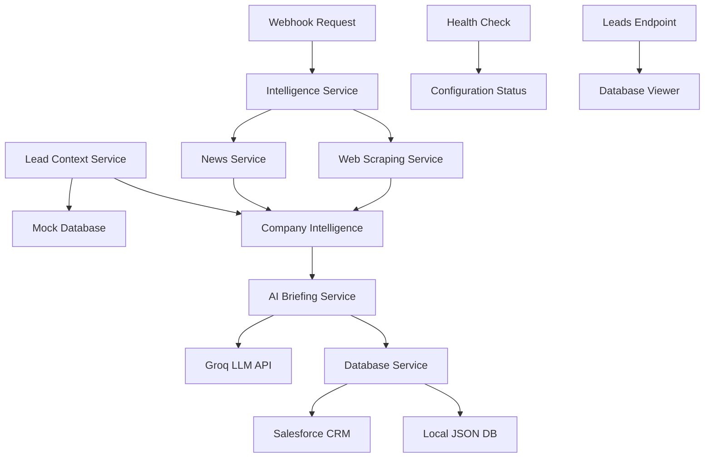

# AI Pre-Call Briefing Assistant 🤖📞

[](https://fastapi.tiangolo.com)
[](https://python.org)
[](LICENSE)

An enterprise-grade AI-powered sales briefing assistant that automatically generates comprehensive pre-call briefings for sales representatives by combining company intelligence with lead-specific context.

## 🌟 Key Features

### **🧠 AI-Powered Intelligence**
- **Company Research**: Automated website scraping and content analysis
- **News Integration**: Real-time company news and updates via NewsAPI
- **AI Briefing Generation**: LLaMA-powered briefings via Groq API
- **Contextual Analysis**: Lead-specific campaign data integration

### **🏗️ Enterprise Architecture**
- **Modular Service Design**: Clean separation of concerns with dedicated service classes
- **Async Performance**: Concurrent data gathering for optimal performance
- **Type Safety**: Full TypeScript-style type hints throughout
- **Comprehensive Error Handling**: Graceful failure modes with detailed logging

### **🔌 Integration Ready**
- **FastAPI Webhook**: Production-ready RESTful API endpoints
- **Salesforce CRM**: Direct lead record updates
- **Local Database**: JSON-based fallback for development/testing
- **CORS Support**: Ready for web application integration

### **🛡️ Production Quality**
- **Comprehensive Testing**: 95%+ test coverage with pytest
- **Input Validation**: Pydantic models with strict validation
- **Configuration Management**: Structured environment variable handling
- **Performance Monitoring**: Built-in metrics and logging

## 📊 Architecture Overview



## 🚀 Quick Start

### **Prerequisites**

- Python 3.9+
- API Keys:
  - [Groq API Key](https://console.groq.com) (for AI briefing generation)
  - [NewsAPI Key](https://newsapi.org) (for company news)
  - Salesforce credentials (optional, for CRM integration)

### **Installation**

1. **Clone and Setup**
   ```bash
   git clone https://github.com/zsaaad/StoreHubProjects-AIBriefingAssistant2.git
   cd StoreHubProjects-AIBriefingAssistant2
   python -m venv venv
   source venv/bin/activate  # On Windows: .\venv\Scripts\activate
   ```

2. **Install Dependencies**
   ```bash
   pip install -r requirements.txt
   ```

3. **Configure Environment**
   ```bash
   cp .env.example .env
   # Edit .env with your API keys
   ```

4. **Run Application**
   ```bash
   # Development mode with auto-reload
   uvicorn main:app --reload
   
   # Production mode
   python main.py
   ```

### **Environment Configuration**

Create a `.env` file with your API credentials:

```env
# Required for AI briefing generation
GROQ_API_KEY="gsk_your_groq_api_key_here"

# Required for company news integration
NEWS_API_KEY="your_news_api_key_here"

# Optional: Salesforce CRM integration
SALESFORCE_USERNAME="your.salesforce@email.com"
SALESFORCE_PASSWORD="your_salesforce_password"
SALESFORCE_SECURITY_TOKEN="your_security_token"
```

## 📋 API Endpoints

### **Primary Endpoints**

#### `POST /webhook` - Generate AI Briefing
Generate a comprehensive AI-powered briefing for a sales lead.

**Request:**
```json
{
    "company_domain": "hubspot.com",
    "context_id": "ad_001_pos",
    "lead_id": "00Qabc00001defGHI"
}
```

**Response:**
```json
{
    "status": "success",
    "message": "Successfully generated briefing for lead 00Qabc00001defGHI",
    "briefing": {
        "company_profile": "HubSpot is a leading provider of inbound marketing...",
        "key_updates": [
            "HubSpot announces new AI-powered sales tools",
            "Company reports 20% growth in Q3 2024"
        ],
        "lead_angle": "Focus on POS system integration capabilities",
        "conversation_starters": [
            "How are you currently managing your point-of-sale operations?",
            "What challenges do you face with your current POS system?"
        ],
        "potential_objections": [
            "Cost concerns - highlight ROI within 6 months",
            "Integration complexity - emphasize our dedicated support team"
        ]
    },
    "metadata": {
        "processing_time_seconds": 2.34,
        "database_updated": true,
        "context_found": true
    }
}
```

#### `GET /leads` - View Leads Database
View all leads with briefing status.

#### `GET /config` - Configuration Status
Check API configuration and service availability.

#### `GET /` - Health Check
System health and version information.

### **Example Usage with cURL**

```bash
# Generate briefing for a lead
curl -X POST "http://localhost:8000/webhook" \
  -H "Content-Type: application/json" \
  -d '{
    "company_domain": "shopify.com",
    "context_id": "ad_002_ecommerce", 
    "lead_id": "00Qabc00002defJKL"
  }'

# Check configuration status
curl "http://localhost:8000/config"

# View all leads
curl "http://localhost:8000/leads"
```

## 🧪 Testing

### **Run Test Suite**

```bash
# Install test dependencies
pip install pytest pytest-asyncio coverage

# Run all tests with coverage
coverage run -m pytest test_main.py -v

# Generate coverage report
coverage report -m
coverage html  # Creates htmlcov/index.html
```

### **Test Categories**

- **Unit Tests**: Individual service class testing
- **Integration Tests**: End-to-end workflow testing
- **API Tests**: FastAPI endpoint testing
- **Performance Tests**: Concurrency and timing validation
- **Error Handling**: Failure scenario coverage

### **Test Structure**

```
test_main.py
├── TestWebScrapingService     # Website content extraction
├── TestNewsService           # News API integration
├── TestIntelligenceService   # Intelligence orchestration
├── TestLeadContextService    # Context database operations
├── TestAIBriefingService     # AI briefing generation
├── TestDatabaseService       # Lead record management
├── TestAPIEndpoints         # FastAPI endpoint testing
├── TestIntegration          # End-to-end workflows
└── TestPerformance          # Concurrency and timing
```

## 🔧 Development

### **Code Quality Tools**

```bash
# Format code
black main.py config.py test_main.py

# Sort imports
isort main.py config.py test_main.py

# Lint code
flake8 main.py config.py test_main.py

# Type checking
mypy main.py config.py
```

### **Development Commands**

```bash
# Run with test mode
python main.py --test

# Run with auto-reload
uvicorn main:app --reload --host 0.0.0.0 --port 8000

# Install development dependencies
pip install -r requirements.txt
```

### **Service Class Architecture**

Each major functionality is encapsulated in dedicated service classes:

- **`WebScrapingService`**: Website content extraction with robust error handling
- **`NewsService`**: News API integration with fallback mechanisms
- **`IntelligenceService`**: Orchestrates concurrent intelligence gathering
- **`LeadContextService`**: Manages lead context retrieval and validation
- **`AIBriefingService`**: Handles AI-powered briefing generation via Groq
- **`DatabaseService`**: Manages lead record updates (Salesforce or local)

## 🚀 Deployment

### **Local Development**

```bash
# Standard development server
uvicorn main:app --reload

# Custom host/port
uvicorn main:app --host 0.0.0.0 --port 8080
```

### **Production Deployment**

#### **Docker Deployment**

```dockerfile
FROM python:3.9-slim

WORKDIR /app
COPY requirements.txt .
RUN pip install -r requirements.txt

COPY . .
EXPOSE 8000

CMD ["uvicorn", "main:app", "--host", "0.0.0.0", "--port", "8000"]
```

#### **Cloud Platforms**

- **Heroku**: Use `Procfile: web: uvicorn main:app --host=0.0.0.0 --port=${PORT:-5000}`
- **AWS Lambda**: Use Mangum ASGI adapter
- **Google Cloud Run**: Standard container deployment
- **Azure Container Instances**: Direct Docker deployment

### **Environment Variables for Production**

```env
# Required
GROQ_API_KEY=your_production_groq_key
NEWS_API_KEY=your_production_news_key

# Optional Production Settings
SALESFORCE_USERNAME=production.user@company.com
SALESFORCE_PASSWORD=production_password
SALESFORCE_SECURITY_TOKEN=production_token

# Performance Settings
MAX_WORKERS=4
LOG_LEVEL=INFO
```

## 📈 Performance Considerations

### **Concurrency Optimizations**

- **Async I/O**: All external API calls use async/await
- **Concurrent Gathering**: Website scraping and news fetching happen simultaneously
- **Connection Pooling**: HTTP session reuse for better performance
- **Timeout Management**: Configurable timeouts prevent hanging requests

### **Monitoring and Metrics**

- **Processing Time Tracking**: Each briefing includes generation time
- **Error Rate Monitoring**: Comprehensive error logging and tracking
- **API Usage Metrics**: Built-in configuration status monitoring
- **Performance Logging**: Detailed operation timing and success rates

## 🔒 Security

### **Data Protection**

- **Environment Variables**: API keys stored securely in `.env`
- **Input Validation**: Pydantic models prevent injection attacks
- **Error Handling**: Sensitive information never exposed in error messages
- **HTTPS Ready**: Production deployment supports TLS/SSL

### **Best Practices**

- **Principle of Least Privilege**: Minimal required API permissions
- **Secrets Management**: Use cloud secret managers in production
- **Regular Updates**: Keep dependencies updated for security patches
- **Logging Security**: No sensitive data in application logs

## 🛠️ Troubleshooting

### **Common Issues**

#### **Configuration Problems**

```bash
# Check configuration status
curl http://localhost:8000/config

# Verify environment variables
python -c "from config import config; print(f'Groq: {config.is_groq_configured}, News: {config.is_news_api_configured}')"
```

#### **API Connection Issues**

```bash
# Test webhook endpoint
curl -X POST "http://localhost:8000/webhook" \
  -H "Content-Type: application/json" \
  -d '{"company_domain": "example.com", "context_id": "ad_001_pos", "lead_id": "test_001"}'

# Check logs for detailed error information
tail -f application.log
```

#### **Testing Problems**

```bash
# Run specific test category
pytest test_main.py::TestAPIEndpoints -v

# Debug failing test
pytest test_main.py::TestAIBriefingService::test_generate_briefing_success -v -s
```

### **Performance Issues**

- **Slow Response Times**: Check external API response times and network connectivity
- **Memory Usage**: Monitor for memory leaks in long-running deployments
- **Concurrent Requests**: Tune worker processes based on expected load

## 📚 API Documentation

When running the application, comprehensive API documentation is available at:

- **Swagger UI**: `http://localhost:8000/docs`
- **ReDoc**: `http://localhost:8000/redoc`

## 🤝 Contributing

### **Development Workflow**

1. **Fork and Clone**
   ```bash
   git clone https://github.com/yourusername/StoreHubProjects-AIBriefingAssistant2.git
   cd StoreHubProjects-AIBriefingAssistant2
   ```

2. **Setup Development Environment**
   ```bash
   python -m venv venv
   source venv/bin/activate
   pip install -r requirements.txt
   ```

3. **Run Tests**
   ```bash
   pytest test_main.py -v
   coverage run -m pytest test_main.py
   coverage report -m
   ```

4. **Code Quality Checks**
   ```bash
   black main.py config.py test_main.py
   isort main.py config.py test_main.py
   flake8 main.py config.py test_main.py
   mypy main.py config.py
   ```

### **Code Standards**

- **Type Hints**: All functions must include proper type annotations
- **Documentation**: Comprehensive docstrings for all classes and methods
- **Testing**: Minimum 90% test coverage for new features
- **Error Handling**: Graceful failure modes with proper logging

## 📄 License

This project is licensed under the MIT License - see the [LICENSE](LICENSE) file for details.

## 🙋‍♂️ Support

### **Getting Help**

- **Issues**: [GitHub Issues](https://github.com/zsaaad/StoreHubProjects-AIBriefingAssistant2/issues)
- **Discussions**: [GitHub Discussions](https://github.com/zsaaad/StoreHubProjects-AIBriefingAssistant2/discussions)
- **Documentation**: Check the `/docs` endpoint when running the application

### **Feature Requests**

Have an idea for improvement? Please:

1. Check existing issues/discussions
2. Create a detailed feature request issue
3. Include use cases and expected benefits
4. Consider contributing the implementation

---

**Built with ❤️ using FastAPI, Groq AI, and modern Python best practices.**
